# **Module 2 Project - Northwind Database**

* Student name: **Alex Husted**
* Student pace: **Online Full Time - April Cohort**
* Scheduled project review date/time: **Wednesday June 19**
* Instructor name: **Rafael Carrasco**
* Blog post URL: ****

# **Project Outline**

This notebook represents the final project in Module 2 of Flatiron's Data Science Bootcamp. The Module began by introducing the mathematical-based topics of linear algebra, calculus, and cost functions. Then a deeper understanding of SQLlite and SQLalchemy were provided with a review of table relationships and databases. Following up, Module 2 initiated the disciplines of webscraping, accessing data through APIs, and employing HTML/CSS syntax. Around the midpoint, the module turned towards intensive lessons on data distributions and sampling. These statistical lessons dove farther in the proceeding sections on combinatorial probabilities and then into hypothesis testing. Module 2 concluded with the practical utilization of the Monty Carlo simulations and extended regression practices. 

In this project, I will be working with the Northwind database - a free, open-source dataset created by Microsoft containing data from a fictional company. The goal of this project is to gather information from a real-world database and utilize existing knowledge of statistical analysis and hypothesis testing to produce analytical insights that can be of value to the company. To accomplish this, I will query the database to get data needed to perform a statistical analysis of **hypothesis questions** generated to help the company analyze strengths and weaknesses, as well as identifying future opportunities. 

The project workflow follows a scientific approach to hypothesis testing. First, in hopes with providing the buisness with valuable insights, a relevant question will be asked about the dataset. Then, two hypothesis in the form of a null and an alternative, will be generated to answer the relevant question. Next, exploration and investigation will occur to determine which sample test should be used to analyze populations within the dataset. Running the test as well as interpreting results will then help accept or reject the given hypothesis. Finally, business recommendations and further work will be provided for the purpose of putting results into action. 

## Hypothesis Testing Framework

  * **State a Question:** What would we like to know about Northwind?
  * **Quantify:** Measure the population to construct a test.
  * **Form a Hypothesis:** Identify the null and alternative hypothesis.
  * **Exploration:** Become curious about the test data. 
  * **Determine a Test:** Find a best-fit test for the hypothesis.
  * **Run a Test:** Complete quantitative operations.
  * **Interpret Results:** Do the results help answer the question?
  * **Recommendation:** Provide the business with scientific insight.
  * **Further Work:** What else can be done?

# **Project PreWork** 

Before moving forward with hypothesis testing, there are necessary steps to become familiar with Northwind. First, importing libraries needed to complete an analysis of the data would be helpful. Then it's important to examine the moving parts within Northwind. Who are the stakeholders? What does Northwind sell? Who are the employees? Who are Northwind's customers? Questions like these will help develop a better understanding of the dataset and eventually will guide effective hypothesis generation. 

## Import Libraries

Import Pandas
Import Numpy
Import SciPy
Import StatsModels
Import SkLearn
Import Seaborn and Matplotlib
Import SQL Alchemy

## SQL Alchemy

For this project I will be using SQLAlchemy. SQLAlchemy provides a “Pythonic” way of interacting with a database. Rather than dealing with the differences between specific dialects of MySQL or SQLite, you can leverage Python framework of SQLAlchemy to streamline your workflow and more efficiently query data. SQLAlchemy can be used to automatically load tables from a database using something called reflection. Reflection is the process of reading the database and building the metadata based on that information. Overall, it provides a full suite of well known enterprise-level persistence patterns, designed for efficient and high-performing database access, adapted into a simple and Pythonic language. 

# **Exploring Northwind**

Exploratory Data Analysis, or EDA, is an integral part of understanding the Northwind dataset. Before moving towards testing hypothesis for the company, it's vital to become familiar with different realtionships within the data. Analyzing these relationships will provide intuition about how to interpret the results of the proceeding results. Asking questions about these relationships beforehand might also supply additional knowledge about relationships that we might have not known existed. This section will further investigate the distribution of data and ask specific questions about the information lying inside the database.

## Table Information

When working with a new database it's vital to inspect the tables until there is confidence in the information retained inside the tables. After fetching data inside tables within the database, an Entity Relationship Diagram can be drawn to depict the relationships within Northwind. This step is not required, but it can provide useful documentation for stakeholders within the company. For this section, I will be retrieving the table names for the database. 

There are 13 table names:
    * Category
    * Customer
    * CustomerCustomerDemo
    * CustomerDemographic
    * Employee
    * EmployeeTerritory
    * Order
    * OrderDetail
    * Product
    * Region
    * Shipper
    * Supplier
    * Territory

The data types of these tables are mainly VARCHARs, INTEGERs and DECIMALs. These tables can store significant amounts of information and therefore it's important to identify where the information is located. In the following hypothesis tests, there will likely be a question pertaining to the amount of products ordered at different discounts. Information on discounts can be found in the 'OrderDetail' table. Information on the unit price of the product can be found in the 'Products' table.

## Employee Queries

An easy task to accomplish is to run a simple SQL query to recover specific items of data within the database. This is straightforward with SQLAlchemy. To do so, we can establish a connection by using the engine object's appropriate method and store it in the variable "con". Then use an appropriate select statement to retrieve the desired information. Directly below is an SQL statement that returns a list of the first three employees queried within the database. This can be stored in a pandas dataframe. 

After completing queries, I found there are nine employees working for Northwind within the Database. There are six sales representatives, one sales coordinator, one sales manager, and one vice president. There are three women and six men. The locations of these employees can be found either in North America or in the British Isles. Also, all employees seem to be highly educated. One unrelated, but unusual point of interest is that each employee has a hire date occurring in the future. Robert King, who serves as a sales representative, is assigned the most territories out of any employee within Northwind with 10. 

## Product Queries

There are eight different categories of products that Northwind sells. Northwind is a food vendor that sells products such as beverages, confections, seafood, condiments, and dairy products. Their total revenue sums to 1.35 million dollars. Their highest revenue generating category is beverages, and their lowest generating category is grains/cereals. They sell a total of 77 products with an average price of 28.80 dollars with a standard deviation of 33 dollars. Their cheapest product is sold at 2.50 dollars and their most expensive product is sold at 263.50 dollars. 

## Customer Queries

There are nine regions in which Northwind products are sold. Western Europe, North and South America account for a large portion of the total number of orders. They also account for the largest portion of order revenue for Northwind. However when looking at the average revenue per order, North America, Northern Europe, and Western Europe are at the top of the list. Finally, there are important items to notice within different companies who order from Northwind. Save-a-lot Markets, Ernst Handel, and Quick-Stop order the most often - each with around 30 orders. Unsurprisingly, they come from the North America and Western European regions. 

# **Hypothesis Testing**

Hypothesis testing is a statistical test that is used to determine whether there is enough evidence in a sample of data to infer that a certain condition is true for the entire population. This is represented as a NULL and ALTERNATIVE hypothesis. The null hypothesis serves as a baseline for a sample control group that infers there is no change in activity for the question at hand. It's the initial claim that researchers specify using previous research or knowledge. The alternative hypothesis is the opposite of the null hypothesis. It states that the population parameter is different than the value of the population parameter in the null hypothesis. The alternative hypothesis is what you might believe to be true or hope to prove true. 

Based on the sample data, the test determines whether to reject the null hypothesis. You use a p-value (a=0.05), to make the determination. If the p-value is less than or equal to the level of significance, which is a cut-off point that you define, and then you can reject the null hypothesis.

## Hypothesis Test 1 - Discounts

**Test Question:**

*Do discounts have a statistically significant effect on the number of products customers order?*

In this test, Northwind will need to determine whether discounts effect the quantity of products customers will buy. To accomplish this, the total amount of products bought by customers will need to be compared to both the inclusion of a discount and the exclusion of a discount. Furthermore, after testing this theory I will explore whether certain levels of discounts effect customer buying habits. 

>**Null hypothesis (Ho)**: Discounts *do not* have a statistically significant effect on the number of products customers order.

>**Alternative hypothesis (Ha)**: Discounts *do* have a statistically significant effect on the number of products customers order.

### Measure Population

The population of orders we are working with is 2,155 entries. Each order may or may not have a discount, which would effect the proportionate revenue from each order. It looks like the discount amounts range from 0% to 25%. It looks like 838 orders actually do carry a discount, therefore, 38.9% of all orders are discounted. 

### Explore Population Data

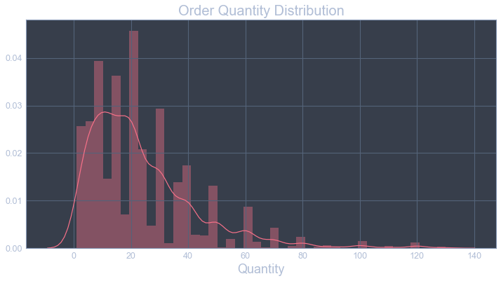

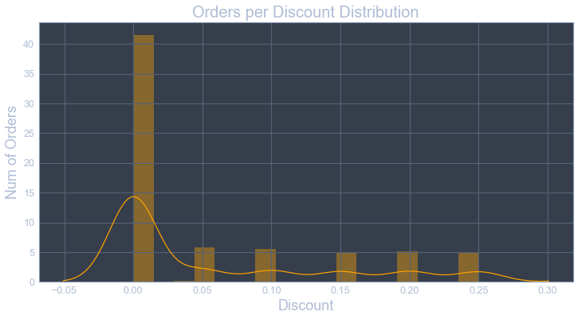

### Set Control Groups

**Dependent Variable**  =  Quantity. This distribution is positively skewed to the right. There is a minimum order quantity of 1 and the largest order totaled 130. The average order equaled roughly 24 units with a standard deviation of 19. 

**Independent Variable**  =  Discount. If there is a discount, the levels of discount range from 5%, 10%, 15%, 20%, 25% increments. However, there is a significant number of orders with no discount applied if you glance at the 'Orders per Discount Distribution' plot.

> The **control group** is comprised of orders that did not receive a discount.

> The **experimental group** is comprised of orders that did receive a discount.

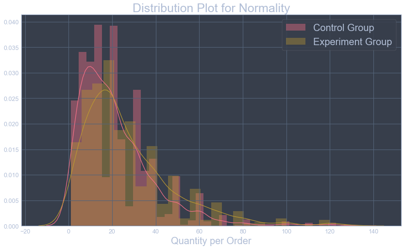

Overall, the distributions for these two groups are very positively skewed. However, these two distributions follow relatively the same shape. So, we could expect the data to fall in the same manner around the means. 

### Run Tests

Because there are unequal variances in the two populations (with a discount and without), the Welch’s t-test can analyze if the two populations have unequal means. This should answer the first part of the question. To do this, the method used will include the Statsmodels library.

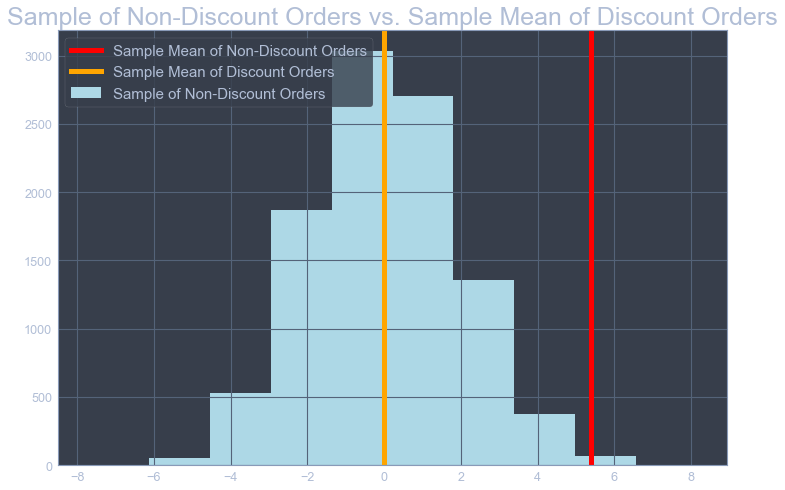

**Welch's T-Test Result**: statistic = 6.4785, pvalue = 1.14409e-10

**Cohen’s d Test**: Result = 0.2863

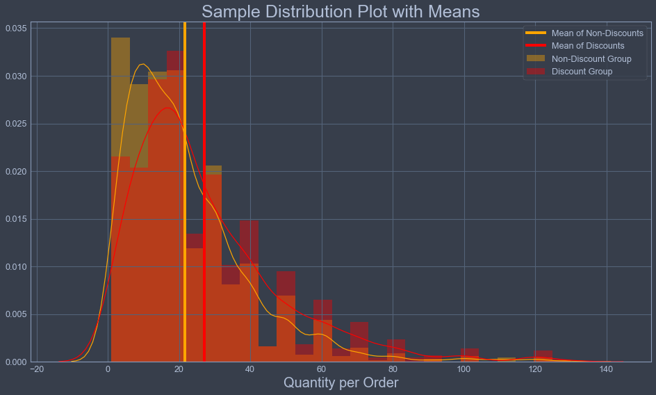

### Interpret Results

**Reject the null hypothesis**. Discounts do have a statistically significant effect on the number of products customers order. 

There is, in fact, an effect discounts have on the order sizes given the p-value is less than the alpha set in the Welch's T-test. The p-value is 1.14409e-10, which is less than 0.05. Therefore, we can become confident in rejecting the null hypothesis. There must be a correlation between the number of products ordered and whether there is a discount applied to the order. Notice there is a clear distinction in sample population means represented by the vertical lines in the visualization above. 

Cohen’s d = 0.2863, implying the difference between the control and experimental groups is significant. It's noteworthy to use discounts to increase the number of items customers make per order. There is statistically significant differences in the mean order sizes of both groups.

## Hypothesis Test 2 - Discounts

**Test Question:**

*Do the level of discounts have a statistically significant effect on the number of products customers order?*

In this test, Northwind will need to determine whether the level of discounts effect the quantity of products customers will buy. To accomplish this, the total amount of discounted products bought by customers will need to be compared to the various levels of discounts applied to those orders.

>**Null hypothesis (Ho)**: Discount levels *do not* have a statistically significant effect on the number of products customers order.

>**Alternative hypothesis (Ha)**: Discount levels *do* have a statistically significant effect on the number of products customers order.

### Measure Population

The population of orders we are working with is 838 entries. Discount amounts range from 0% to 25%. It looks like 838 orders actually do carry a discount, therefore, 38.9% of all orders are discounted. 
    * There are 185 orders with a 5% discount. 
    * There are 173 orders with a 10% discount. 
    * There are 157 orders with a 15% discount.
    * There are 161 orders with a 20% discount.
    * There are 154 orders with a 25% discount.

### Explore Population Data

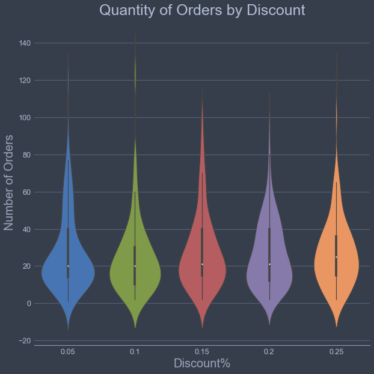

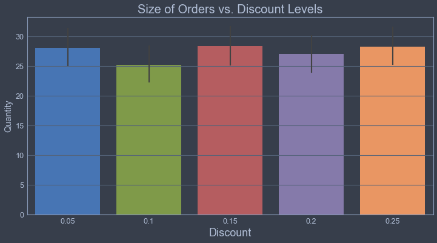

It seems the levels of discounts follow almost a uniform distribution. The 10% level of discount carries the lowest amount of orders. The 25% level of discount carries the highest amount of orders. 

### Run Tests

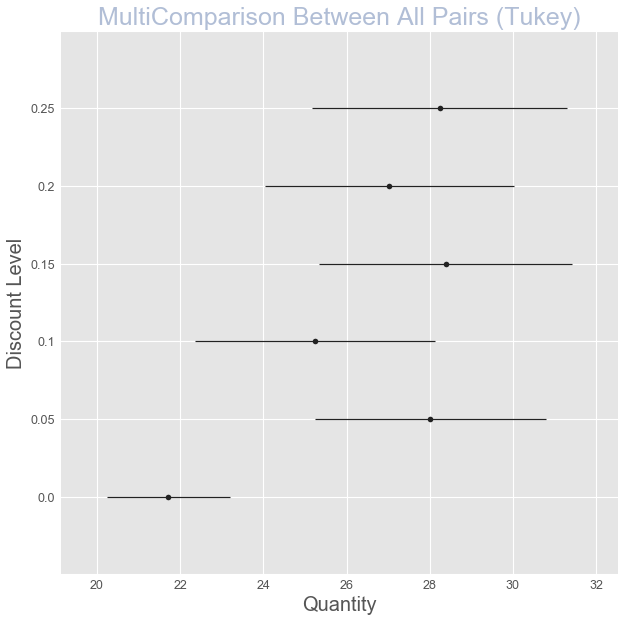

### Interpret Results

**Reject the null hypothesis for all discount levels except for 10%**. All Discount levels do have a statistically significant effect on the number of products customers order, except for the 0.10 discount bracket.

There is, in fact, an effect the level of discounts have on the order sizes given results of the Tukey test. The Tukey HSD test is a statistical tool used to determine if the relationship between any two sets of data is statistically significant - indicating whether there's a strong chance that an observed numerical change in one value related to a change in another value.  The Tukey test is invoked when you need to determine if the interaction among three or more variables is mutually statistically significant. 

Given the results of the table shown above, we can reject the null hypothesis in all accounts except for the 10% bracket. This doesn't mean giving a 10% discount is harmful, it's simply implying that the results don't yield enough evidence to reject the null hypothesis in the 10% case. For all other discount brackets, there must be a correlation between the increase of number of products ordered and which discount level is applied.

## Hypothesis Test 3 - Months

**Test Question:**

*Do customers order more products in particular months of the year?*

In this test, Northwind will need to determine whether quantity from customer orders varies the different months in a year. To accomplish this, the total quantity from customer orders will need to be compared to the various months of the year in which those products were ordered.

>**Null hypothesis (Ho)**: Northwind order quantity *does not* vary between customer orders in different months.

>**Alternative hypothesis (Ha)**: Northwind order quantity *does* vary between customer orders in different months.

### Measure Population

The population of orders we are working with is 2,155 entries. Each order has been separated into a new column by it's month name. By looking at value counts for this row, April has the highest amount of customer orders with 261. June has the least amount of customer orders with only 76. 

### Explore Population Data

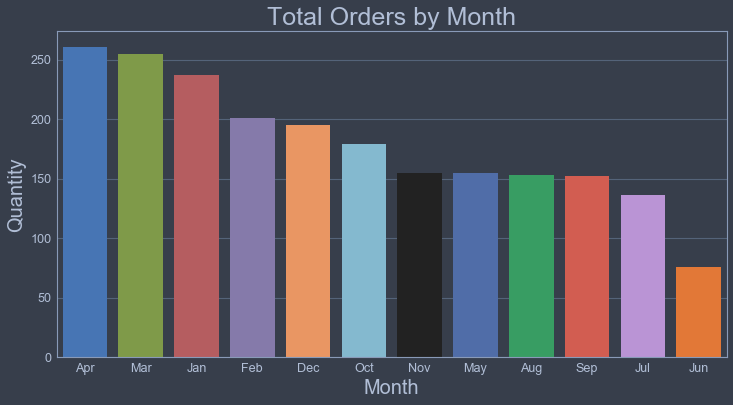

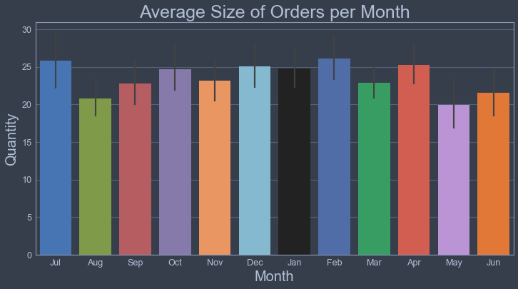

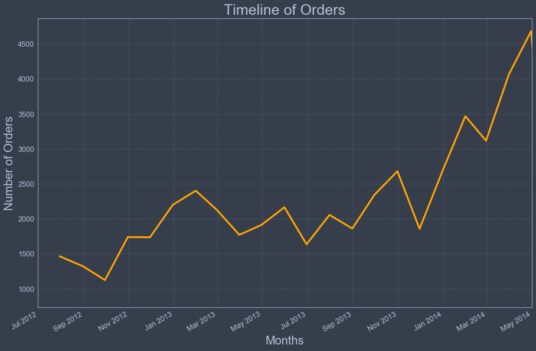

### Run Tests

This test will be executed through a process called ANOVA. This tests generalizes procedures to test differences, such as in the mean of populations, between multiple groups. This starts with sample observations from multiple groups. Since ANOVA is looking to explain the total variance as combinations of variance from the various groups, we typically design a multiple groups experiment to test various independent factors that we hypothesis may influence the overall result. In this experiment, the 'multiple groups' are signified by the various *months* within Northwind.

ANOVA TEST: PR(>F) = 0.039229

### Interpret Results

**Rejected the null hypothesis**. Northwind order quantity *does* vary between customer orders in different months. There is, in fact, a significant variation in order quantities between different months of the year. The p-value is less than the alpha set in the Welch's T-test. The p-value is 0.039229, which is less than the standard alpha of 0.05. If we were to have previously set an alpha value lower then the standard 0.05, such as 0.03, we could have failed to reject the null hypothesis. This result is close to our alpha, so it could be suggested to run another test or research an acceptable p-value for this experiment. June could be indicated as an outlier in this experiment because the month only occurs once in the dataset.

## Hypothesis Test 4 - Regions

**Test Question:**

*Does Northwind order revenue alternate between customer orders from different regions?*

In this test, Northwind will need to determine whether order revenue from customer orders varies between the regions they serve. To accomplish this, the total amount of revenue from customer orders will need to be compared to the various regions in which those products were ordered.

>**Null hypothesis (Ho)**: Northwind order revenue *does not* alternate between customer orders from different regions.

>**Alternative hypothesis (Ha)**: Northwind order revenue *does* alternate between customer orders from different regions.

### Measure Population

The population of orders we are working with is 2,078 entries. Each order may or may not have a discount, which would effect the proportionate revenue from each order. Western Europe has the most amount of orders with 736. Eastern Europe has the least amount of orders with only 16. 

### Explore Population Data

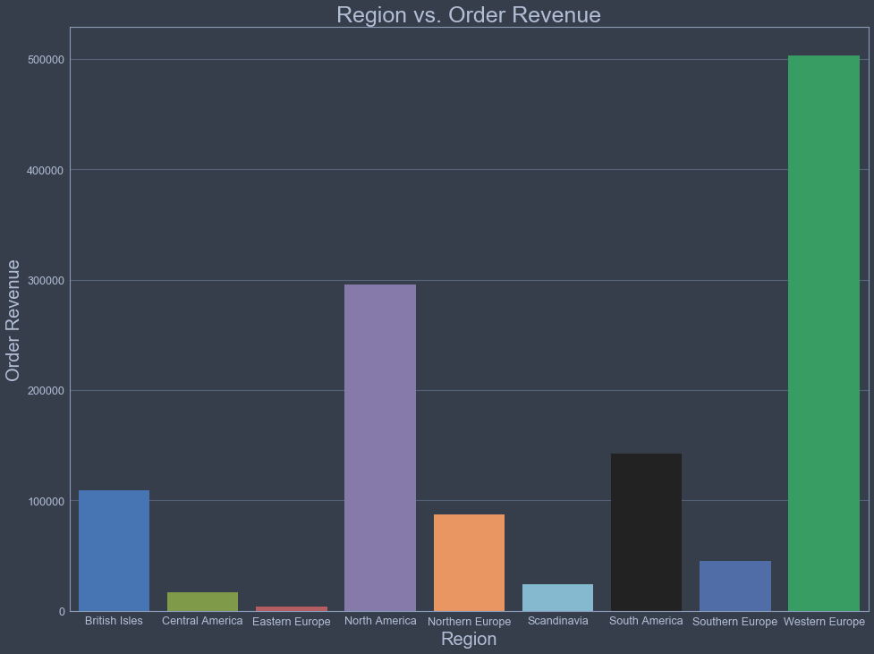

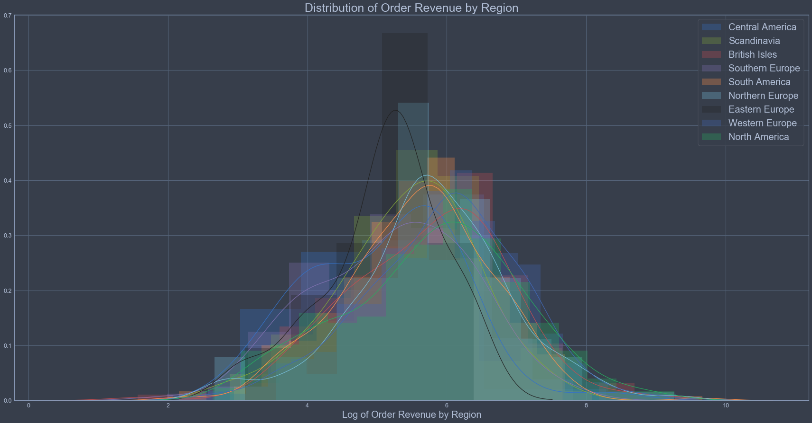

Clearly there are differences in the mean, or average revenue per region. Northwind should expect to receive different levels of income from various regions. North America holds the highest revenue per order at 692.70 dollars. Eastern Europe holds the lowest revenue per order 220.75 dollars. Let's run a test on a sample group to see if this holds true. 

### Run Tests

This test will be executed through a process called ANOVA. This tests generalizes procedures to test differences, such as in the mean of populations, between multiple groups. This starts with sample observations from multiple groups. Since ANOVA is looking to explain the total variance as combinations of variance from the various groups, we typically design a multiple groups experiment to test various independent factors that we hypothesis may influence the overall result. In this experiment, the 'multiple groups' are signified by the various *regions* within Northwind. 

**ANOVA TEST**: PR(>F) = 3.619410e-14

### Interpret Results

**Rejected the null hypothesis**. Northwind revenue *does* alternate between customer orders from different regions.

Provided with the result of  PR(>F) = 3.619410e-14 in the ANOVA test and an alpha set to 0.05, I can be confident in rejecting the null hypothesis. There is a statistically significant difference in the revenue from customer orders in different regions. On average, customers from different regions will buy different quantities of products in quite disparate ways. North America, Northern Europe, and the British Isles formulate the highest revenue per orders. Eastern Europe and Central America compose of the lowest revenue per order.

## Hypothesis Test 5 - Products

**Test Question:**

*Does Northwind order revenue alternate between customer orders from different product categories?*

In this test, Northwind will need to determine whether order revenue from customer orders varies between the categories of products they sell. To accomplish this, the total amount of revenue from customer orders will need to be compared to the various product categories of which those products were ordered.

>**Null hypothesis (Ho)**: Northwind order revenue *does not* alternate between customer orders from different product categories.

>**Alternative hypothesis (Ha)**: Northwind order revenue *does* alternate between customer orders from different product categories.

### Measure Population

The population of orders we are working with is 830 entries. Each order may or may not have a discount, which would effect the proportionate revenue from each order. The category of beverages has the most amount of orders with 162. Grains and Cereals has the least amount of orders with only 46. The average revenue per order is the highest in the meat/poultry category. The average revenue per order is the lowest in the grains/cereals category.

### Explore Population Data

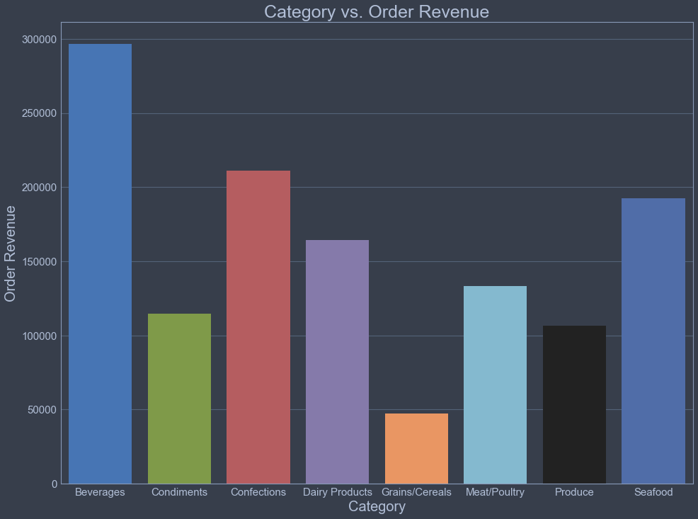

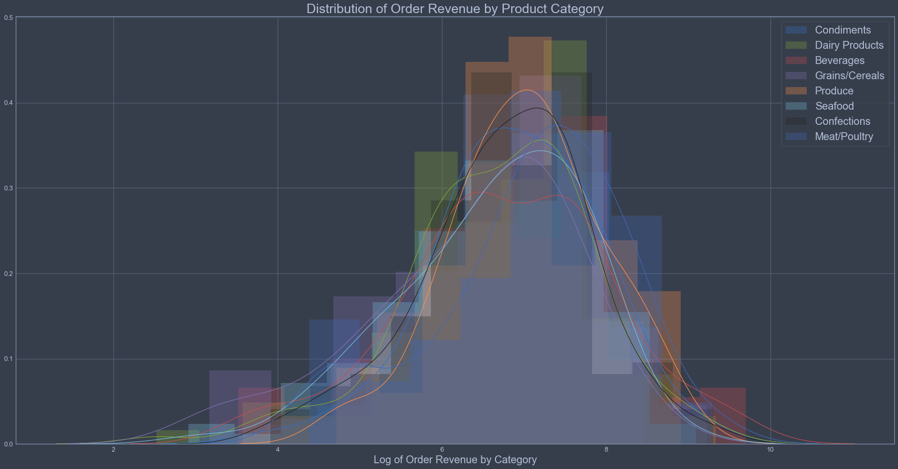

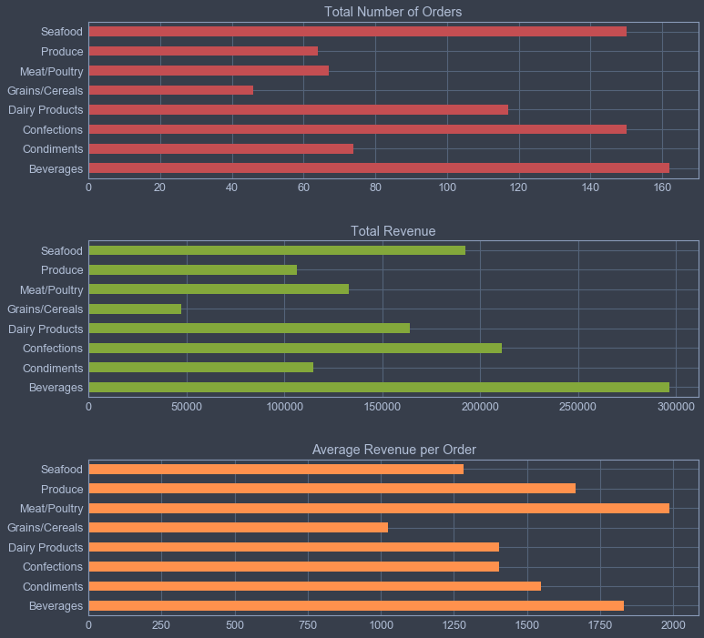

### Run Tests

This test will be again executed through a process called ANOVA. This tests generalizes procedures to test differences, such as in the mean of populations, between multiple groups. This starts with sample observations from multiple groups. Since ANOVA is looking to explain the total variance as combinations of variance from the various groups, we typically design a multiple groups experiment to test various independent factors that we hypothesis may influence the overall result. In this experiment, the 'multiple groups' are signified by the various *Product Categories* within Northwind. 

**ANOVA TEST**: PR(>F) = 0.017976

### Interpret Results

**Rejected the null hypothesis**. Northwind revenue *does* alternate between customer orders from different product categories.

Provided with the result of PR(>F) = 0.017976 in the ANOVA test and an alpha set to 0.05, I can be confident in rejecting the null hypothesis. There is a statistically significant difference in the revenue from customer orders in different product categories. On average, Northwind will incur variations in revenue based upon which product category is included in the order. Meat/Poultry, Beverages, and Produce formulate the highest revenue per orders. Grains/Cereals compose of the lowest revenue per order. 

# **Conclusions**

To reiterate the usefulness of this business case, Northwind will use the resulting hypothesis tests to make future business decisions about current business practices - including discount levels, supply stocks, region awareness, and product promotions. The scope of the project included the Northwind database, the economic health of buyers in the corresponding regions, and the value of predictors that contribute to product sales. The project began on Monday June 10th, 2019 and was completed within a week, on Sunday June, 16th 2019. It's expected that all stakeholders involved will conclude with the same understanding of the hypothesis testing.

### Recommendation 1

**Add 5% Discounts to Products**

Overall on average, when there is a discount applied to an order, customers will add 5.39 more units to their order. Also, there is a statistically significant difference in quantity between products that have a 5%, 10%, 15%, %20, and 25% discount compared to orders that have with no discount. Adding discounts incentivizes the customers to buy more of a given product at almost all discount levels tested. Specifically, the optimum level of discount is 5% because it retains the most amount of revenue for the company and customers buy over 6.2 more units (more than the average discount at all levels). 

### Recommendation 2

**Stock Up Before Quarter 1**

Northwind order quantity varies between customer orders in different months. Specifically, order quantities are much higher in the earlier months of the year compared to the later months. Between the months of January through April, 954 orders out of 2155 are completed. That totals to 44% of all orders are completed in the first four months of the year. Furthermore, there is a significant variation in order quantities between different months of the year. The four months at the beginning of the year also incur a *higher than average* order size. These orders are almost 2 units higher than the average order in the year.

### Recommendation 3

**Target North America**

There is a difference in the revenue from customer orders in different regions. Western European customers place the most orders and are the most important region for Northwind’s bottom line. Nevertheless, even though North American customers have placed roughly half as many orders as those from Western Europe, they spend more per order, on average. North American consumers spend 8 more dollars on orders compared to the leading region of Western Europe. North American customers have placed a similar number of orders to those from South and Central America, but their average expenditure per order is almost 2x higher. 

### Recommendation 4

**Sell More Meat/Poultry** 

There is a difference in the revenue from customer orders in different product categories. The product category of beverages both account for the highest total amount of orders and the most revenue out of any other category. However, even though the meat/poultry category is ordered almost 2.4x less than the beverage category, the meat/poultry category accounts for the highest per order revenue. When customers buy meat/poultry, they spend almost 200 dollars more on the order. 

### Overall Recommendation

**Create A Plan**

Before the start of Q1 next year, run a 5% discount promotion on meat/poultry products for North American consumers. 

### Further Work

**Need Information on Cost of Goods Sold**

If Northwind could provide a table within this database to identify the cost of production and distribution for products they sell, there could a vast number of testing to be completed and recommendations to be given. If COGS was provided, further analysis of product profits, including discounts, could be applied. 
